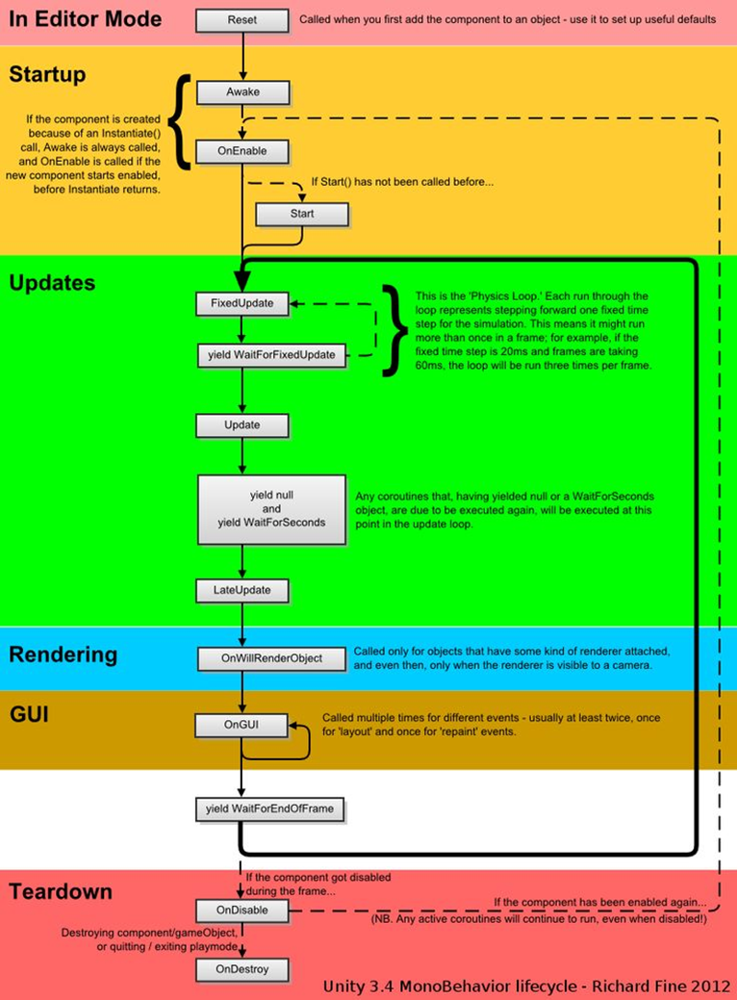
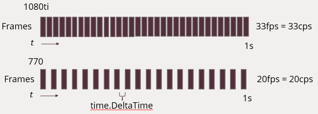
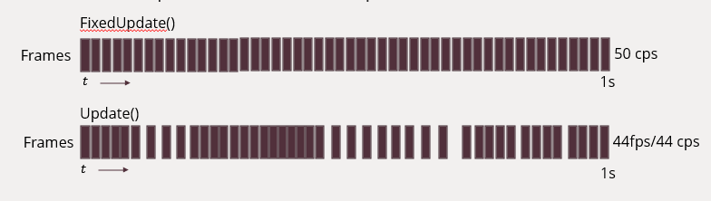
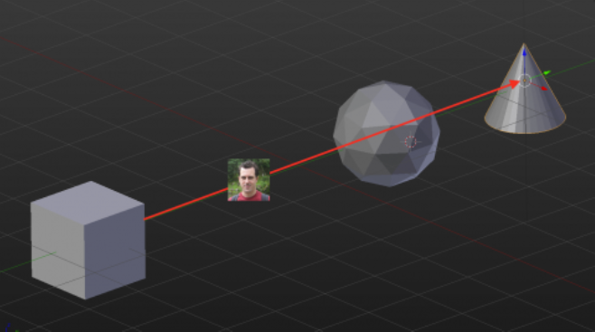

# Gane Dev Exam 2 Review 

## Week 6-7 
### About Unity -- Chapter 1
---

- unity is a platform for 2d, 2d, vr and ar games and apps 
- easily connect to people on pc, consoles, web, mobile devices, home entertainment, embedded systems, head mount displays 

### tools and resources 
--- 
- Unity Asset Store 
- Unity cloud build 
- unity analytics
- unity ads 
- unity certification 

### Unity Facts 
* 85 billion downloads per month of apps built with unity since 2020
* 2.5 billion monthly active users who used unity to create content 
* forfront of the gorwing vr market 
    * 90% of samsung gear vr games and 53% of oculus Rift(at launch) were made with unity 

### Limitations 
---
* Asset Creation 
    * Modeling 
        * Blender 
        * Maya 
        * 3ds Max 
    * Texturing 
    * Sound and Music 
    
### Intro to GameObjects -- Chapter 2 
--- 
- models are converted to GameObjects
- everything in the __hierarchy__ is a GameObj

### Components -- Chapter 3 
---
- GameObj = noun -> component = verb 

#### RigidBody 
---
- main component that enables physical behavior for GameObj 
    - adding a **rigidbody** component auto opts GameObj to physics engine 
- __Rigidbody__ attached obj auto responds to gravity 
- one or more __collider__ components added, Obj moved by incoming collisions 
- can use script to change the transform properties of the GameObj 
- w/ __rigidbody__ generally apply forces to push GameObj and let physics engine calc results 
- some cases where you want a GameObj to have a __rigidbody__ w/o having physics engine 
    - you may want to contol a character directly from script code but still allow it to be detected by triggers 
    - non-physical motion produced from script is called _kinematic_ motion 
##### isKinematic 
- tells physics engine you are manually controlling GameObj 
- physics engine is still aware of where the GameOnj is and when it collides 
    - useful because it will tell you when 2 GameObjs collide and you can do something 

##### Gravity 
- allows __rigidbody__ to opt in/out of gravity on specific GameObj

### Into to Scripting 
--- 
- unity used to support other languages like Javascript and boo 
- most pro devs use C#
- unitys implemantation of Javascript was not Javascript 
    - called UnityScript and different from Javascript 

- 2017 js was dropped and C# is the only supported language 

- derive from __MonoBehaviour__ and can override several methods 
    - __Update()__ occurs every frame 
        - 60fps = 60 update calls 
        - don't want heavy processing 
    - __OnEnable()__ called when GameObj is enabled 
        - also when inactive GameObj suddenly reactivates 
        - you can deactivate GameObj when you dont need them until a later point 
    - __Start()_ called once before __Update()__
        - good place for init 
    - __Destroy()__ called before the obj goes to the afterlife (R.I.P)
    
    ### Call cycle ↓
    - A complete listing of events can be found at 
    the MonoBehavior reference on Unity’s site:
    - https://docs.unity3d.com/ScriptReference/MonoBehaviour.html
    
    

### Accessing Input from Code 
--- 
- any __public__ is displayed in inspector of the Obj 
#### Example 
```
public float moveSpeed = 50.0f;
```
#### Update() Example 
```
void Update() {
    //1 
    Vector3 pos = transform.position;
    //2 
    pos.x += Input.GetAxis("Horizontal") * moveSpeed * Time.deltaTime;
    //3
    pos.z += Input.GetAxis("Vertical") * moveSpeed * Time.deltaTime;
    //4
    transform.position = pos;
}
```
  

#### Explaining ↑
- 1st line gets the GameObj current pos and applys to var 
- 2nd line gets the horizontal input and multiplies by moveSpeed and Time.deltaTime
- 3rd line gets the vertical input and multiplies by moveSpeed and Time.deltaTime
    - obj only be on x and z since y if for ↑↓
- 4th line is to apply transform.position to Obj 

### More on Update() and DeltaTime 

- movement varies depending on game run speed 

## Week 8 

### Colliders 
--- 
#### Mesh Collider 
- creates collider boundaries from an actual mesh object  
- great option for complicated models 
- can be "expensive" - takes a lot of resources to maintain and determine collisions 
- helps to have a very low-poly collider 
- to create a low-poly collider, you take the og model and strip it of extraneous detaiul until you are down to the shape

### Character Controllers 
---
- built in component that makes it easier to make characters in youe game move based on input 
- to add a Character Controller, click add component, physics, choose character controller 
``` 
void Start(){
    characterController = getComponent<CharacterController>();
}

movement is in the update()

void Update() {
    Vector3 moveDirection = new Vector3(Input.GetAxis("horizontal"), 0, Input.GetAxis("Vertical"));
    characterController.SimpleMove(moveDirection * moveSpeed);
}

Simplemove() is a built in method that automatically  move the character in the given direction, not allowing the character to go through obastacles 
```

### FixedUpdate() 
---
- handles physics 
- called at consistent intervals and no subject to fps 
- anything that affects the __rigidbody__ should be in __FixedUpdate()__
- by default, Unity calls it evey 0.02 seconds or 50 times per second   
### __Example ↓__


### Raycasting 
--- 
- converts mouse from 2d to a 3d space 
- shoots invisable lasers from a target to a destination and sends a notification when it hits a GameObject 
- usually used to test if another player was struck by a projectile 


### __Example ↓__ 
The following example shows a raycast from a cube to a cone. Since the ray has a cone mask on it, it ignores the sphere and reports the hit on the cone 

- you can cast a ray from the camera to the mouse pointer 
    - so the player turns where the mouse is 
### __Example Code↓__
```
public LayerMask layerMask;
private Vector3 currentLookTarget = Vector3.zero;
```
- __LayerMask__ indicates what layers the ray should hit 
- __currentLookTarget__ is where the character wants to stare 
    - set it to zero since you don't know where to look in the beginning 
#### Next add to __FixedUpdate()__
```
void FixedUpdate() {
    RaycastHit hit;
    Ray ray = Camera.main.ScreenPointToRay(Input.mousePosition);
    Debug.DrawRay(ray.origin, ray.direction * 1000, color.green);
}

    - first create an empty RaycastHit
        - if you get a hit it'll be populated with an object 
    - second create the ray form the main camera to the mouse 
    -The last line will draw a ray in the Scene view while you’re playing the game.
```
## Week 9 
### __Intro to Game Manager__ 
---
- unity refers to an obj that handles a specific sub system as a manager 
    - an input manager is an obj that lets you adjust all the controls of your game 
    - settings manager handles all the project settings
    - Network Manager for managing the state of a networked game 
- Game manager allow you to easily tweak your game settings while its being played 
- unity doesnt have a "stock" game manager 
### __Intro to Pathfinding__ 
---
#### __4 objs make a Navigation System__ 
1. __NavMesh__ repersents walkable areas 
2. __NavMesh Agent__ Actor or Agent using NavMesh 
3. __Off-Mesh Link__ shortcut that cant be repersented on the map
    - gap that characters can actually cross
4. __NavMesh Obstacle__ obstacles that the agent should avoid 

### __Intro to Mecanin__
- animation system 
- Mecanin is a powerful animation system that can be used to create complex animations

## Week 10 
### Playing Sound 
---
- unity contains a built in audio engine 
- avoid formats sucha as mp3 because unity re-encodes compressed files to lower quality when it exports 
- unity doesnt factor level geometry when playing sounds 
    - Sounds will be heard through walls as if they are next to you 
### __Audio Listener__  
- to hear sounds it requires an __Audio Listener__ 
__Audio Listener__ component is attached to the GameObj 
### __Audio Source__ 
- object that emits sound 
    - includes background music and sound effects 
### __Create a Sound Manager__ 
``` 
public class SoundManager : MonoBehaviour {

    // instance will store a static reference to the single SoundManager 
    public static SoundManager Instance = null; 
    // refers to the audio source you added to the SoundManager 
    private AudioSource soundEffectAudio; 
}
```

### __Audio mixer__ 
- built in audio mixer to allow you to make adjustments to various audio settings 

### __The Unity Event System__ 
--- 
- allows you to notify an object or set when an event occurs
- to notify the listeners use __Invoke()__ 

### __The Particle System__ 
--- 
- particles are small bit of geometry created by the game engine 
    - can create effects like fire, water, other chaotic systems 

## __Week 11__ 
### __Tags__ 
--- 
- reference word which can assign to one or more GameObj
- help identify GameObjs for scripting purposes 
- dont need to manually drag and drop, so it saves time when using same code for multiple GameObjs 
- useful triggers in collider control scripts 
- need to work out wheteher the player is interacting with an enemy, prop, or a collectable for example 
- each GameObj may only have one tag 

## __Week 12__ 
### __SerializedField__ 
---
- allows you to expose a field in the inspector but not other scripts 

### __Intro to Coroutines__ 
---
- a powerful tool in Unity that help manage time-based actions and maintain smooth gameplay without blocking the main thread
- takes methods that -> __IEnumerator__ 
- any var or parm will be correctly preserved between the yields 
- by defalut, coroutine is resumed on the frame after it yields 
    - can be delayed using __WaitForSeconds__ 
### __Example Code↓__ 
```
void Start() {
    StartCoroutine("deathTimer");
}

tells unity that when a missile is instantiated start a coroutine called deathTimer()

IEnumerator deathTimer() {
    yield return new WaitForSeconds(10);
    Destroy(gameObj);
}

immediatley returns a 10 second wait 
- once 10 sec is passed method will resume after yield 
```

